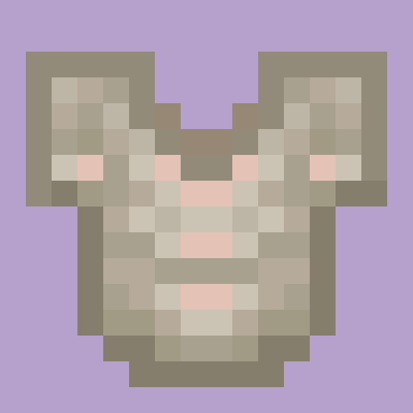

  

  
<h1 align="center"> More Weaponry </h1>

  <a href="https://curseforge.com/minecraft/mc-mods/more-weaponry">CurseForge</a> 
  | <a href="https://modrinth.com/mod/more-weaponry">Modrinth</a>
  

## About
More Weaponry implements new tools and bosses for your journey! Explore the vast plains and uncover the secrets that were left locked in stone, or travel to the baren landscape of the End dimension and unleash a forgotten evil that lies in an ancient tower! Many other secrets lie across the world.

## Contributing
If you would like to contribute to the mod, whether that be by suggesting a feature or simply suggesting quality of life changes (bugfix, crash fix, etc.), then please, feel free to create a bug report labelled as 'enhancement' on our issues page!

## Translating
Hello! I am currently looking for translators! Specifically French (Canada), as while there are only minor differences, I want to make sure that this mod can be enjoyed without language barriers! If you would like to help translate this mod, feel free to create a bug report providing the language file (text form or file download) and I will make sure to get to it! (As mentioned on the Curseforge page, you will not be paid, but will be labelled as contributor on the mod)